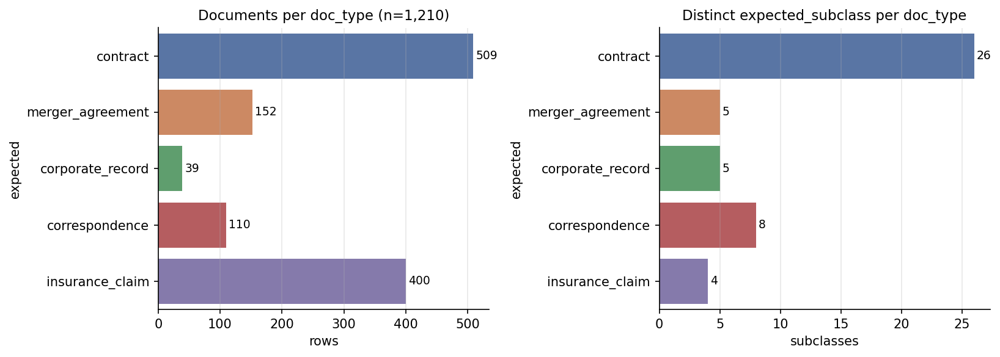

<div align="center">

# 📊 Mailroom-Corpus EDA

**Full-corpus exploratory data analysis for the mailroom-corpus — 1,650 legal documents across 5 classes, 48 strata, with centralized HuggingFace upload helpers.**

[](https://www.python.org/)
[](reports/SUMMARY_REPORT.md)
[](https://huggingface.co/datasets/Lucius-Morningstar/mailroom-corpus)



</div>

---

## Corpus at a Glance

<div align="center">

| Metric | Value |
|:---|:---|
| **Documents** | 1,650 |
| **Doc Types** | 5 (insurance_claim, contract, correspondence, merger_agreement, corporate_record) |
| **Strata** | 48 |
| **Imbalance Ratio** | 15.4× |
| **CUAD Spans** | 13,753 |
| **Offset Match** | 100% |

</div>

<div align="center">

| Class | Count | % |
|:---|---:|---:|
| `insurance_claim` | 600 | 36.4% |
| `contract` | 509 | 30.8% |
| `correspondence` | 350 | 21.2% |
| `merger_agreement` | 152 | 9.2% |
| `corporate_record` | 39 | 2.4% |

</div>

## Quick Start

```bash
git clone https://github.com/Exios66/Mailroom-Corpus-EDA.git
cd Mailroom-Corpus-EDA

# 1. Install dependencies
.venv/bin/pip install -r requirements.txt

# 2. Run the full pipeline (P0–P6)
.venv/bin/python run_all.py

# 3. Or run just the figures
.venv/bin/python run_all.py --phases P3 P4
```

## Pipeline (run_all.py)

<div align="center">

| Phase | What | Output |
|:---|:---|:---|
| **P0** | Corpus download + manifest validation | `data/parquet/**` |
| **P1** | Structural integrity & provenance audit | `reports/tables/integrity_report.json` |
| **P2** | Composition: strata, imbalance, provenance | `strata_counts.csv`, `imbalance_metrics.json` |
| **P3** | Static PNG figures + EDA tables | `reports/figures/`, `reports/tables/` |
| **P4** | Interactive Plotly HTML figures | `reports/figures_interactive/` |
| **P5** | Cast-safe JSONL + parquet staging helpers | `data/staging/` |
| **P6** | Correspondence intent coverage & provenance audit | `reports/SUMMARY_REPORT.json` |

</div>

## Reports

| Artifact | Description |
|:---|:---|
| [`reports/SUMMARY_REPORT.md`](reports/SUMMARY_REPORT.md) | Narrative summary of all findings |
| [`reports/figures/`](reports/figures/) | 30 static PNGs (text/token, CUAD, MAUD, claims, correspondence, imbalance, temporal, metadata) |
| [`reports/figures_interactive/`](reports/figures_interactive/) | 18 Plotly HTML figures |
| [`reports/tables/`](reports/tables/) | CSV/JSON tables |

## Dataset Cards

Per-source documentation for the five corpora integrated into [`mailroom-corpus`](https://huggingface.co/datasets/Lucius-Morningstar/mailroom-corpus) lives in [`docs/dataset-cards/`](docs/dataset-cards/):

| Corpus | Doc Type | Count | Card |
|:---|:---|---:|:---|
| CUAD contracts | `contract` | 509 | [View →](docs/dataset-cards/cuad-contracts.md) |
| MAUD merger agreements | `merger_agreement` | 152 | [View →](docs/dataset-cards/maud-merger-agreements.md) |
| S-1 corporate records | `corporate_record` | 39 | [View →](docs/dataset-cards/s1-corporate-records.md) |
| Enron correspondence | `correspondence` | 350 | [View →](docs/dataset-cards/enron-correspondence.md) |
| CMS DE-SynPUF insurance claims | `insurance_claim` | 600 | [View →](docs/dataset-cards/cms-desynpuf-insurance-claims.md) |

## HF Hub Interface

The upload/publish helpers previously living in [llm-entity-extraction](https://github.com/Exios66/llm-entity-extraction) are centralized here:

| Module | Purpose |
|:---|:---|
| `src/mailroom_eda/hf_interface.py` | Hub client (upload, sha256 verify, repo mgmt) |
| `src/mailroom_eda/dataset_export.py` | Cast-safe metadata (KANBAN-076), JSONL line-boundary safety (KANBAN-088), parquet staging |
| `src/mailroom_eda/docclass_uploader.py` | Docclass v7 publish, surgical card rendering, blind-label strip, GT leak guard |
| `src/mailroom_eda/intent_backfill.py` | Correspondence intent hydration (issue #5): cross-walk, Enron/AESLC sha256 join, LLM pass |
| `src/mailroom_eda/token_budget.py` | Token estimation & budget coverage |

### CLI Commands

<details>
<summary>Intent backfill & publish commands</summary>

```bash
# Correspondence intent backfill (issue #5; needs OPENROUTER_API_KEY for LLM pass)
.venv/bin/python scripts/backfill_intent.py --check
.venv/bin/python scripts/backfill_intent.py --join-only
.venv/bin/python scripts/backfill_intent.py            # full Phases 1-5

# Stage the v7 dump into the Hub tree (no upload)
.venv/bin/python scripts/publish_docclass.py --rows data/v7_rows.jsonl \
    --stage /tmp/stage --intent-stats data/v7_intent_stats.json

# Publish to https://huggingface.co/datasets/Lucius-Morningstar/mailroom-corpus
HF_TOKEN=hf_... .venv/bin/python scripts/publish_docclass.py \
    --rows data/v7_rows.jsonl --stage /tmp/stage \
    --intent-stats data/v7_intent_stats.json \
    --commit-message "issue #5: v7 intent hydration" --publish

# Byte-verify a local export against the Hub
.venv/bin/python scripts/verify_hf.py --repo Lucius-Morningstar/mailroom-corpus \
    --jsonl data/hf_export/mailroom-cuad-contracts-full.jsonl
```

</details>

## Key Findings

- **Merger agreements are longest**: mean ~356k chars ≈ 89k tokens — **exceeds 32k/65k contexts**
- **Insurance claims uniformly short**: ~1,200 chars, σ=186
- **Token budget**: 65% ≤4k, 82% ≤16k, 88% ≤32k, 99.7% ≤131k
- **CUAD**: 509 contracts × 41 clause types; 13,753 spans, 100% exact offset
- **MAUD**: 152 agreements × 22 tasks; 3 tasks annotated on every agreement
- **Insurance**: 9/13 fields 100% filled; coverage determination fully populated
- **Correspondence**: intent 100% hydrated (issue #5); sentiment-labeled subset

---

<div align="center">

**[llm-mailroom](https://github.com/Exios66/llm-mailroom)** ·
**[llm-entity-extraction](https://github.com/Exios66/llm-entity-extraction)** ·
**[llm-dojo-scoring](https://github.com/Exios66/llm-dojo-scoring)** ·
**[Enron-Evaluation-Environment](https://github.com/Exios66/Enron-Evaluation-Environment)** ·
**[claims-data-eda](https://github.com/Exios66/claims-data-eda)**

<sub>Built by the governed evaluation family under <a href="https://github.com/Exios66">@Exios66</a> · 2026</sub>

</div>
